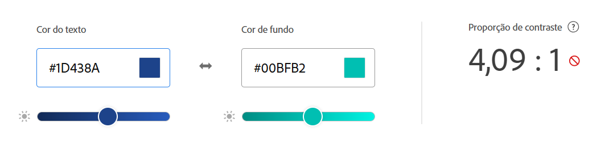
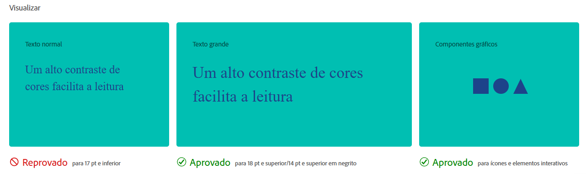

# Contraste de Cores

Garantir um contraste adequado é vital para usuários com baixa visão ou daltonismo. Este tópico demonstra como validar sua paleta usando o **Adobe Color**.

---

## 1. Analisando a Proporção (Ratio)

De acordo com a **WCAG AA**, a razão de contraste mínima para texto normal é de **4.5:1**. 

No exemplo abaixo, vemos uma combinação que **falhou** na validação:

* **Cor do Texto:** #1D438A (Azul escuro)
* **Cor de Fundo:** #00BFB2 (Ciano)
* **Resultado:** **4,09:1** — Abaixo do mínimo exigido para textos pequenos.

---

## 2. Visualização e Verificação

O Adobe Color permite visualizar como diferentes tipos de elementos se comportam com a paleta escolhida:

### Critérios de Aprovação:
* **Texto Normal (17pt e inferior):** ❌ **Reprovado** — Dificulta a leitura para muitos usuários.
* **Texto Grande (18pt+):** ✅ **Aprovado** — O tamanho maior compensa o contraste levemente abaixo do ideal.
* **Componentes Gráficos:** ✅ **Aprovado** — Ícones e elementos de UI possuem regras menos rigorosas.

---

## Como Corrigir?
Sempre utilize as barras de ajuste do Adobe Color para escurecer o texto ou clarear o fundo até atingir o selo verde de **Aprovado** para todos os tamanhos de fonte.

---

## Link para a Ferramenta

Para realizar os testes demonstrados acima, utilize o simulador oficial:

* **[Acesse o Adobe Color (Ferramentas de Acessibilidade)](https://color.adobe.com/pt/create/color-contrast-analyzer)**

Ao abrir o link, você poderá colar os códigos Hexadecimais (ex: #1D438A) e verificar em tempo real se a sua paleta atende aos critérios da WCAG.