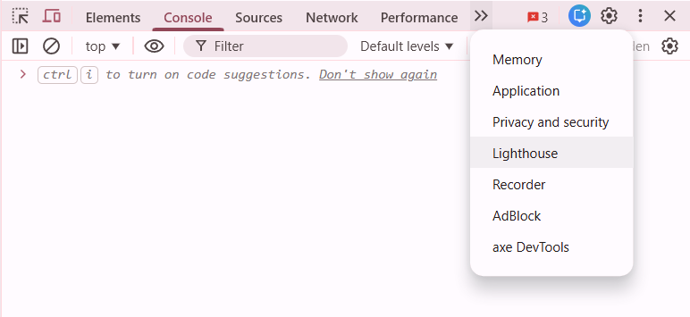
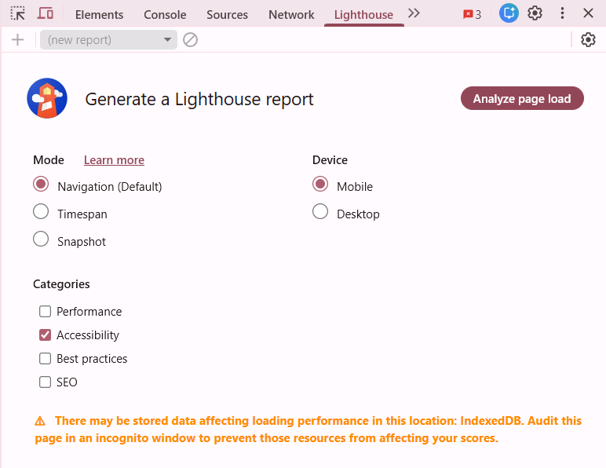

# Auditoria de Acessibilidade com Lighthouse

O **Lighthouse** é uma ferramenta automatizada do Google que valida se o seu site segue as diretrizes da WCAG, fornecendo uma nota de 0 a 100 para a acessibilidade da página.

---

## Como Executar a Auditoria

Siga este passo a passo para gerar o seu primeiro relatório:

1. **Abra o seu site** no navegador Google Chrome.
2. Pressione **F12** (ou clique com o botão direito e selecione "Inspecionar").
3. No menu superior do painel que abriu, procure pela aba **Lighthouse**. 



4. Em "Categories", selecione apenas a opção **Accessibility**.



5. Clique no botão **Analyze page load** e aguarde o processamento.

---

## Como Interpretar os Resultados

Após o processamento, você verá um relatório detalhado:

### 1. A Pontuação (Score)
* **90-100 (Verde):** O site segue a maioria das boas práticas automatizáveis.
* **50-89 (Laranja):** Existem falhas importantes que precisam de atenção.
* **0-49 (Vermelho):** O site apresenta barreiras críticas de acessibilidade.

### 2. Itens Reprovados (Failing Audits)
Aqui o Lighthouse listará exatamente o que está errado. Por exemplo:
> *"Elements must have alternate text"* -> Indica que você esqueceu o `alt` em alguma imagem (Tópico 01).

### 3. Verificações Manuais
O Lighthouse avisa que **testes automatizados não detectam tudo**. Ele listará itens que você deve testar manualmente, como a lógica da navegação por teclado (Tópico 07).

---

## Boas Práticas de Correção

Sempre que encontrar um erro, aplique a correção semântica que discutimos nos guias anteriores:

```html
<button class="btn-fechar">X</button>

<button class="btn-fechar" aria-label="Fechar modal">X</button>